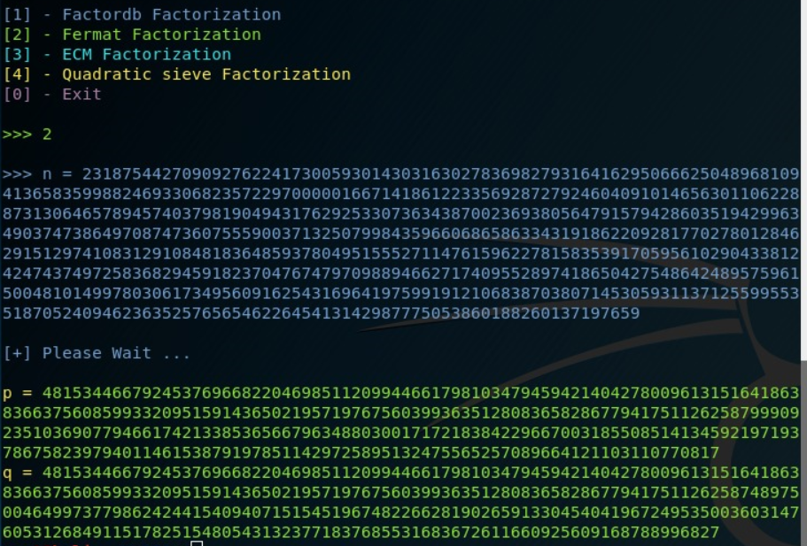
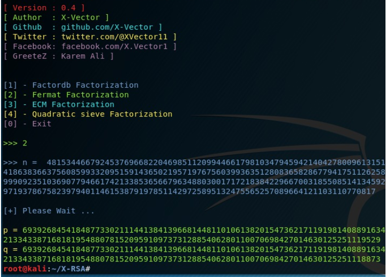
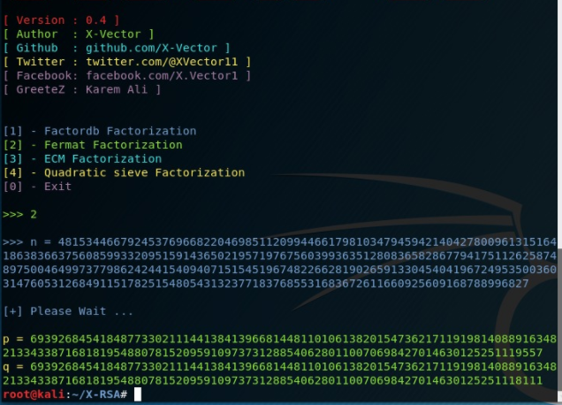

# Challenge 3 

First, i tried to get factors of n from online sources, found nothing 
so i tried to use some factorizing methods , and i found when
using fermant factorization i got the following p and q using [X-RSA tool](https://github.com/X-Vector/X-RSA) .



```
p = 48153446679245376966822046985112099446617981034794594214042780096131516418638366375608599332095159143650219571976756039936351280836582867794175112625879990923510369077946617421338536566796348803001717218384229667003185508514134592197193786758239794011461538791978511429725895132475565257089664121103110770817

q = 48153446679245376966822046985112099446617981034794594214042780096131516418638366375608599332095159143650219571976756039936351280836582867794175112625874897500464997377986242441540940715154519674822662819026591330454041967249535003603147605312684911517825154805431323771837685531683672611660925609168788996827
```

After checking if they are prime or not with miller-rabin, i found that both are not prime
so i used fermant factorization again with the p and q i got earliear, and i got the following p's and q's 




```
p1=6939268454184877330211144138413966814481101061382015473621711919814088916348213343387168181954880781520959109737312885406280110070698427014630125251119529

q1=6939268454184877330211144138413966814481101061382015473621711919814088916348213343387168181954880781520959109737312885406280110070698427014630125251118873
```


```
p2=6939268454184877330211144138413966814481101061382015473621711919814088916348213343387168181954880781520959109737312885406280110070698427014630125251119557

q2=6939268454184877330211144138413966814481101061382015473621711919814088916348213343387168181954880781520959109737312885406280110070698427014630125251118111


```

Then i check if they are primes or not, and yes i found that they are primes, and that was it we got our prime numbers.

And finally, here is the python script i used to solve it.

```python
p1=6939268454184877330211144138413966814481101061382015473621711919814088916348213343387168181954880781520959109737312885406280110070698427014630125251119529
q1=6939268454184877330211144138413966814481101061382015473621711919814088916348213343387168181954880781520959109737312885406280110070698427014630125251118873
p2=6939268454184877330211144138413966814481101061382015473621711919814088916348213343387168181954880781520959109737312885406280110070698427014630125251119557
q2=6939268454184877330211144138413966814481101061382015473621711919814088916348213343387168181954880781520959109737312885406280110070698427014630125251118111
n = 2318754427090927622417300593014303163027836982793164162950666250489681094136583599882469330682357229700000166714186122335692872792460409101465630110622887313064657894574037981904943176292533073634387002369380564791579428603519429963490374738649708747360755590037132507998435966068658633431918622092817702780128462915129741083129108481836485937804951555271147615962278158353917059561029043381242474374972583682945918237047674797098894662717409552897418650427548642489575961500481014997803061734956091625431696419759919121068387038071453059311371255995535187052409462363525765654622645413142987775053860188260137197659
e = 65537
ct = 1852258477078452495280071169336816541669321769289372837198526954361460776833319048556839287633046754304414868057993901219892835088957705515939202089076460374548771033553266251154753679870528816210706553445963568771841753267644973871132621342897934474998162148362874305941012572949171990616677298854465965898581914403406403426504250013897086136105989549801404176555930509653029014518314103310549883855327513190607775750086851774949594618287441246861446444592130784569563671269161854267497652454746479173284327272563799067627736512266913669944284375302659511122504002144054772208775215907860036195680830269422876824977
from Crypto.Util.number import long_to_bytes, inverse
phi=(p1-1)*(q1-1)*(p2-1)*(q2-1)
d = inverse(e, phi)
m = pow(ct, d, n)
print(long_to_bytes(m))

```

**ASCWG{you_need_fermat_factorization_to_solve_RSA_Small_diffrince_Prime_Attack_12312}**


