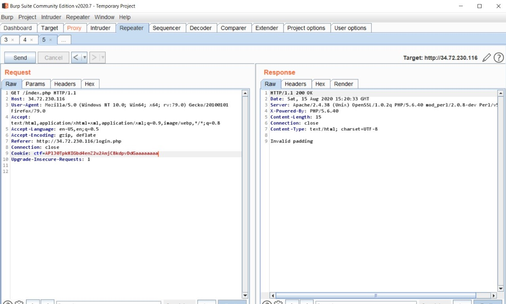
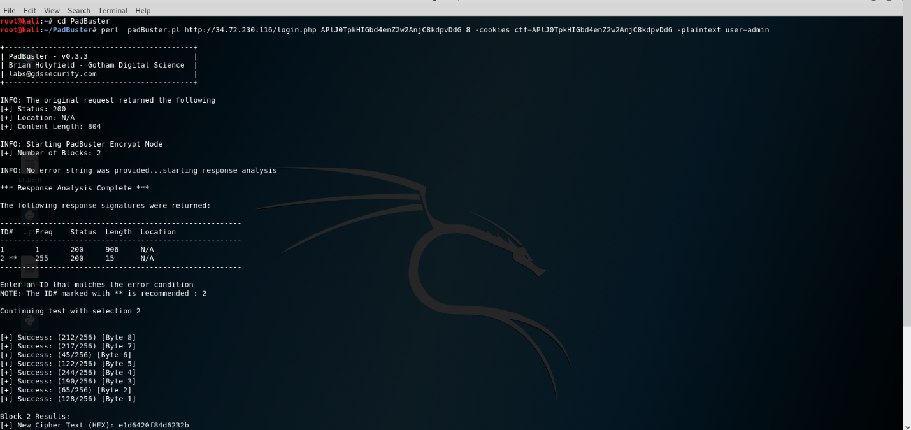
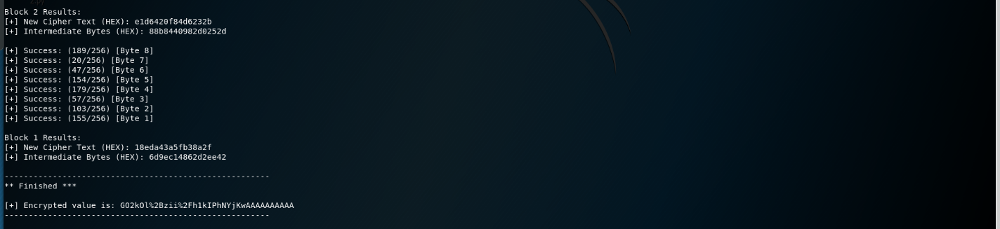
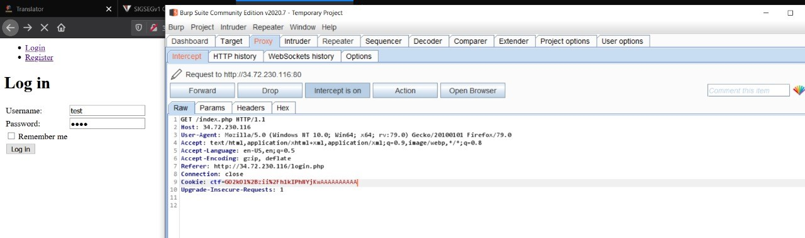
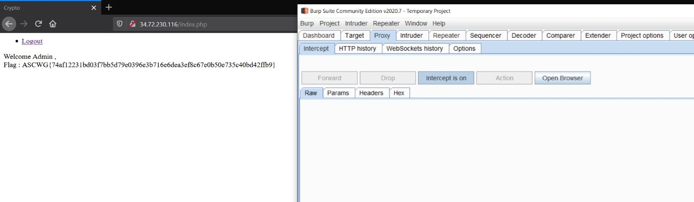

# Challenge 4 

[Challenge Link](https://github.com/ascwg/Challenges/blob/master/Crypto/Challenge%204)

We first create an account and see the cookies, when we try to increase the cookie value, we got invalid padding.

So, it's AES CBC mode with wrong implementation, this challenge is Padding Orcale Attack.

Now, Let's use padbuster tool to get the admin cookie.

Admin cookie : `GO2kOl%2Bzii%2Fh1kIPhNYjKwAAAAAAAAAA`.

And we got the flag! 

**ASCWG{74af12231bd03f7bb5d79e0396e3b716e6dea3ef8c67e0b50e735c40bd42ffb9}**

