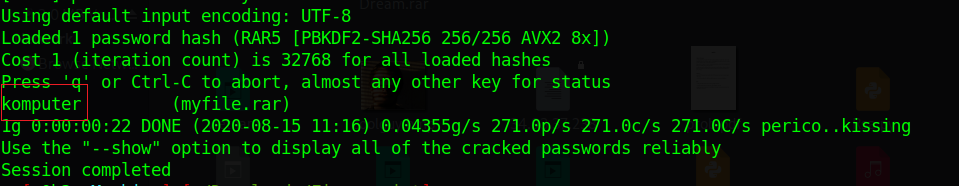

# Fingerprint 

We got a rar archive file, after extracting it we got 7 images, i couldn't find anything interesting in any of them except the third image `3.jpg`.

When running `strings` on `3.jpg` i see this base64 encoded value.

Then i decode this value and i got the following hex content. 

Then i decode this hexdump, i got the following text.

Hmmmmm, we can see the Rar archive signature at the beginning of that text.

So, Let's convert the previous hex to file using this website [Tomeko](https://tomeko.net/online_tools/hex_to_file.php) or `xxd` tool.

I got the rar archive file, but it is protected with password.

using `john the ripper` we can crack the password.

the password is `komputer`.

Then extract the content of that archive, we got a text file which contains the flag.

