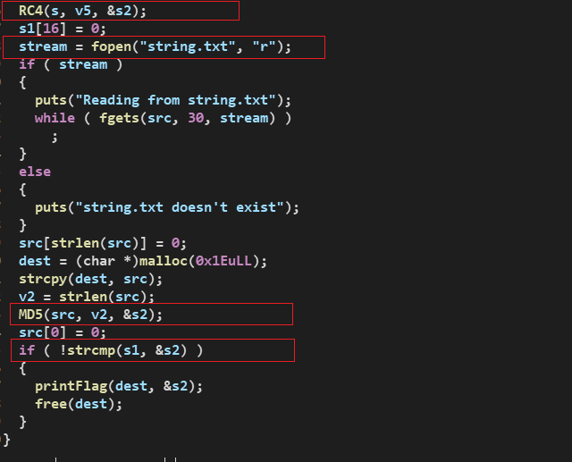
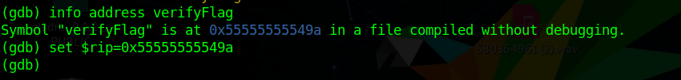
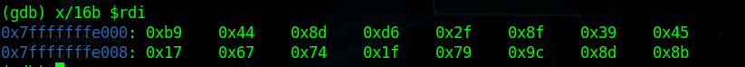

# DOOM

[Challenge Link](https://github.com/ascwg/Challenges/raw/master/Reverse/DOOM.rar)

First, I loaded the binary into IDA, we can see at the named functions view there are `verifyFlag`, `printFlag` functions but the main function doesn't call any of them.

Taking a look at the verifyFlag function we can see it does the following :

- Decrypt a hardcoded value using RC4 algorithm.
- read the content of string.txt file.
- get the md5 hash of the content of string.txt.
- compare the hash with our decrypted value.
- if they are equal, it will print the flag in the following foramt `ASCWG{contentOfTheFile}`.

So, we need to see what gets compared with the md5 hash of the file.

Now, we need to get this function called by changing the rip to the address of that function.

Then set a breakpoint before strcmp gets called.

Examinig the rdi register we can find the hash.

The md5 hash of the flag is `b9448dd62f8f39451767741f799c8d8b`.

Then crack the hash and we got `apocolypsedoomsday`.

Flag: **ASCWG{apocolypsedoomsday}**
