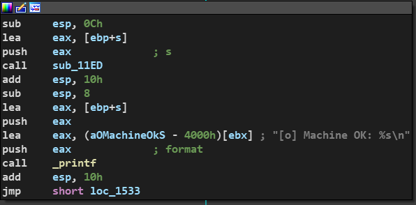
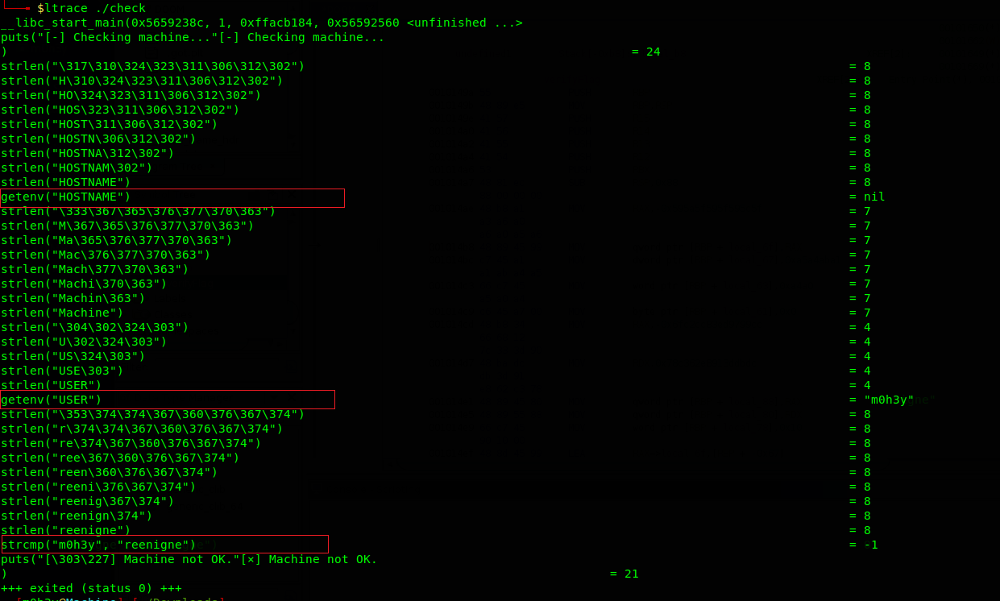
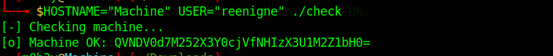

# check

[Challenge Link](https://github.com/ascwg/Challenges/raw/master/Reverse/check.rar)

First, I loaded the binary into ida, I see some checks are made before it can reach this block of code that prints `Machine Ok`.

Using ltrace to see what library functions it calls .

It gets the environment variables `HOSTNAME`, `USER` and compares them with `Machine`, `reengine` respectively. 

Now we can open the binary in gdb, bypass all the checks until it prints the flag or we can run it with the environment variables we need and it will print the flag. 

We got the following base64 encoded value `QVNDV0d7M252X3Y0cjVfNHIzX3U1M2Z1bH0=`.

Decode it and then we got the flag : **ASCWG{3nv_v4r5_4r3_u53ful}**
